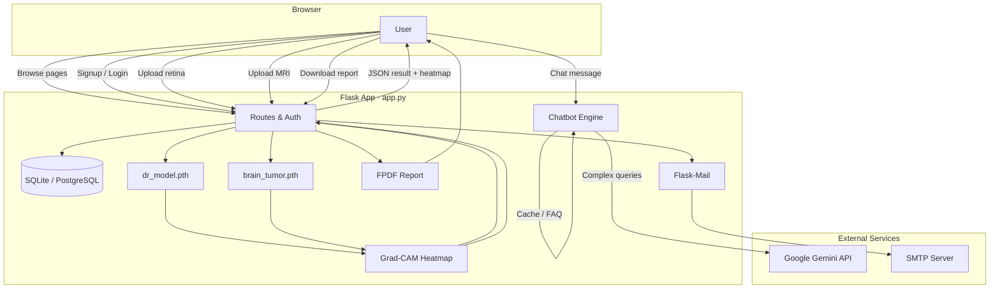

<<<<<<< HEAD
=======
>>>>>>>
<div align="center">

# 👁️ MindAye

### *AI-powered medical imaging for early detection — when every moment matters.*

**Upload retina or brain scans · Get instant AI analysis · Chat with a medical assistant · Download clinician-ready reports**

<br>

[](https://www.python.org/)
[](https://flask.palletsprojects.com/)
[](https://pytorch.org/)
[](https://ai.google.dev/)

<br>

[Features](#-features) ·
[How It Works](#-how-it-works) ·
[Screenshots](#-screenshots) ·
[Quick Start](#-quick-start) ·
[Configuration](#-configuration) ·
[API](#-api-overview) ·
[Team](#-team) ·
[Disclaimer](#%EF%B8%8F-important-disclaimer)

</div>

---

## 🩺 What is MindAye?

**MindAye** (also branded as *NeuroVision AI* in parts of the backend) is a full-stack healthcare web application that helps users and clinicians get **fast, preliminary insights** from medical images — without replacing professional diagnosis.

| Domain | Input | AI output |
|--------|--------|-----------|
| **Diabetic retinopathy** | Retina fundus photos (JPG, PNG, DICOM) | 5-stage classification + confidence score |
| **Brain tumors** | MRI / brain scans (JPG, PNG, DICOM) | 4-class tumor type or healthy |

The platform combines **custom-trained EfficientNet-B0 models**, **explainable AI (Grad-CAM heatmaps)**, a **Google Gemini–powered assistant**, and **PDF + email reports** — all behind secure signup/login.

> ⚠️ **MindAye is a decision-support tool, not a licensed medical device.** Always confirm results with a qualified healthcare provider.

---

## ✨ Features

| Feature | Description |
|---------|-------------|
| 🔬 **Dual AI models** | Separate PyTorch models for diabetic retinopathy and brain tumor detection |
| 🎯 **Confidence scores** | Softmax-based probability for each prediction |
| 🗺️ **Grad-CAM heatmaps** | Visual overlay showing which regions influenced the AI decision |
| 🏥 **DICOM support** | Read `.dcm` / `.dicom` files in-memory via `pydicom` |
| 🔒 **Privacy-first uploads** | EXIF metadata stripped from standard images before processing |
| 🤖 **Smart chatbot** | FAQ cache, medical knowledge base, and Gemini API fallback |
| 📄 **PDF reports** | AI-generated narrative + diagnosis bundled into downloadable reports |
| 📧 **Email delivery** | Optional report attachment via Flask-Mail (SMTP) |
| 👤 **User accounts** | SQLAlchemy auth with hashed passwords (SQLite locally, PostgreSQL in production) |
| 🌐 **Cloud-ready** | Deployed via [Render](https://render.com) using `gunicorn` (`render.yaml` included) |

---

## 🧠 Model performance

Models are trained in the included Jupyter notebooks (`Brain_tumor.ipynb`, `diabetes_ratinopathy.ipynb`) using **EfficientNet-B0** architectures.

| Model | Classes | Reported accuracy |
|-------|---------|-------------------|
| **Brain tumor** | `glioma`, `meningioma`, `pituitary`, `notumor` | ~**98%** |
| **Diabetic retinopathy** | `No_DR`, `Mild`, `Moderate`, `Severe`, `Proliferate_DR` | ~**84%** |

Place trained weights at:

```
models/
├── dr_model.pth
└── brain_tumor.pth
```

> These `.pth` files are required at runtime. They are not bundled in the repo — train locally or obtain them from your team.

---

## 🏗️ How it works



### Classification reference

**Brain tumor (MRI)**

| Label | Meaning |
|-------|---------|
| `glioma` | Tumor arising from glial cells |
| `meningioma` | Tumor from brain/spinal meninges |
| `pituitary` | Pituitary gland tumor (often benign) |
| `notumor` | No detectable tumor |

**Diabetic retinopathy (fundus)**

| Label | Meaning |
|-------|---------|
| `No_DR` | No diabetic retinopathy |
| `Mild` | Early microaneurysms |
| `Moderate` | Some vessel blockage |
| `Severe` | Extensive vessel blockage |
| `Proliferate_DR` | Advanced proliferative stage |

After analysis, the app recommends specialists (e.g. **Ophthalmologist** for DR, **Neurologist** for brain findings).

---

## 📸 Screenshots

<p align="center">
  
  
</p>

<p align="center">
  
  
</p>

<p align="center">
  
  
</p>

<p align="center">
  
</p>

---

## 🚀 Quick start

### Prerequisites

- **Python 3.9+**
- **pip** and a virtual environment (recommended)
- **CUDA GPU** (optional, speeds up inference)
- Trained model weights in `models/` (see above)
- A **Google Gemini API key** for the chatbot and report narratives

### 1. Clone the repository

```bash
git clone https://github.com/<your-org>/MIND-A-EYE.git
cd MIND-A-EYE
```

### 2. Create a virtual environment

```bash
python -m venv venv

# Windows
venv\Scripts\activate

# macOS / Linux
source venv/bin/activate
```

### 3. Install dependencies

```bash
pip install -r requirements.txt
pip install flask-sqlalchemy pydicom numpy pytorch-grad-cam
```

> `app.py` uses packages beyond `requirements.txt`. Install the extra line above for full functionality (DB, DICOM, Grad-CAM).

### 4. Configure environment variables

Create a `.env` file in the project root (see [Configuration](#-configuration)).

### 5. Run the application

```bash
python app.py
```

Open **http://127.0.0.1:5000** in your browser, sign up, log in, and upload a scan from the **Upload** page.

### Deploy on Render

The repo includes `render.yaml`. Connect the repository on Render; set environment variables in the dashboard; use:

- **Build:** `pip install -r requirements.txt`
- **Start:** `gunicorn app:app`

---

## ⚙️ Configuration

| Variable | Required | Description |
|----------|----------|-------------|
| `SECRET_KEY` | Recommended | Flask session secret |
| `GEMINI_API_KEY` | **Yes** (chatbot/reports) | Google Generative AI API key |
| `DATABASE_URL` | Optional | Defaults to `sqlite:///neurovision.db`; use PostgreSQL in production |
| `MAIL_SERVER` | Optional | SMTP host (default: `smtp.gmail.com`) |
| `MAIL_PORT` | Optional | SMTP port (default: `587`) |
| `MAIL_USERNAME` | Optional | SMTP username |
| `MAIL_PASSWORD` | Optional | SMTP app password |
| `MAIL_DEFAULT_SENDER` | Optional | From address for report emails |
| `PORT` | Optional | Port for local/production server (default: `5000`) |

**Example `.env`:**

```env
SECRET_KEY=your-secret-key-here
GEMINI_API_KEY=your-gemini-api-key
DATABASE_URL=sqlite:///neurovision.db

MAIL_SERVER=smtp.gmail.com
MAIL_PORT=587
MAIL_USERNAME=your-email@gmail.com
MAIL_PASSWORD=your-app-password
MAIL_DEFAULT_SENDER=your-email@gmail.com
```

Never commit `.env` or API keys to version control.

---

## 📁 Project structure

```
MIND-A-EYE/
├── app.py                    # Main Flask app, routes, models, Grad-CAM, reports
├── chatbot.py                # Standalone chatbot module (Gemini + knowledge base)
├── utils.py                  # Diagnosis result helpers
├── requirements.txt          # Core Python dependencies
├── render.yaml               # Render.com deployment config
├── Brain_tumor.ipynb         # Brain tumor model training notebook
├── diabetes_ratinopathy.ipynb# Diabetic retinopathy training notebook
├── models/                   # Trained weights (not in repo — add locally)
│   ├── dr_model.pth
│   └── brain_tumor.pth
├── templates/                # Jinja2 HTML pages
│   ├── homepage.html
│   ├── upload.html
│   ├── chat.html
│   ├── report.html
│   └── ...
├── static/                   # CSS and assets
└── reports/                  # Generated PDFs (created at runtime)
=======
# MINDAEYE

**MIND** + **EYE** — AI medical image analysis in one Flask app.

| Name | Domain | Input | Model |
|------|--------|-------|-------|
| **MIND** | Brain tumor | MRI (JPG/PNG) | EfficientNet-B0, 4 classes |
| **EYE** | Diabetic retinopathy | Fundus photo (JPG/PNG) | EfficientNet-B0, 5 stages |

> Decision-support tool for portfolio and research. Not a licensed medical device.

---

## Features

- Dual PyTorch models with lazy loading (loads only the model you use)
- Softmax confidence scores
- **Full class probability distribution** (all classes, not just top-1)
- **Prediction history** per user (SQLite)
- Grad-CAM heatmaps (explainable AI)
- Simple PDF report download
- User signup / login (SQLite)

---

## Project structure

```
MIND-A-EYE/
├── app.py                      # Flask backend (~280 lines)
├── models/
│   ├── dr_model.pth            # EYE model weights (required)
│   └── brain_tumor.pth         # MIND model weights (required)
├── templates/
│   ├── homepage.html
│   ├── upload.html
│   ├── history.html
│   ├── login.html
│   └── signup.html
├── Brain_tumor.ipynb           # Training notebook
├── diabetes_ratinopathy.ipynb  # Training notebook
├── requirements.txt
└── render.yaml                 # Deploy config
```

---

## Quick start

```bash
cd MIND-A-EYE
python -m venv venv
venv\Scripts\activate        # Windows
pip install -r requirements.txt

# Place your .pth files in models/
python app.py
```

Open http://localhost:5000 → Sign up → Upload → Analyze

### Environment variables (optional)

```env
SECRET_KEY=your-secret-key
DATABASE_URL=sqlite:///mindaye.db
PORT=5000
>>>>>>> 1737881 (Update Flask application and UI)
```

---

<<<<<<< HEAD
## 🔌 API overview

Protected routes require an active login session.

| Method | Endpoint | Description |
|--------|----------|-------------|
| `POST` | `/predict/dr` | Upload retina image → DR classification + heatmap |
| `POST` | `/predict/brain_tumor` | Upload brain MRI → tumor classification + heatmap |
| `GET` | `/get_latest_result` | Fetch last diagnosis with specialist hint |
| `GET` | `/download_report?name=...` | Generate PDF report (optional email) |
| `POST` | `/chatbot` | JSON `{ "message": "..." }` → AI response |
| `POST` | `/signup` | Register new user |
| `POST` | `/login` | Authenticate user |

---

## 🛠️ Tech stack

| Layer | Technologies |
|-------|----------------|
| **Backend** | Python, Flask, SQLAlchemy, Werkzeug |
| **ML / CV** | PyTorch, Torchvision (EfficientNet-B0), OpenCV, PIL, Grad-CAM, pydicom |
| **AI assistant** | Google Generative AI (Gemini 1.5 Flash) |
| **Reports** | FPDF, Flask-Mail |
| **Frontend** | HTML, Tailwind CSS (CDN), JavaScript, Axios |
| **Training** | Jupyter / Google Colab notebooks |
| **Deploy** | Gunicorn, Render |

---

## 👥 Team

| Role | Contributor |
|------|-------------|
| Frontend development | **Mohit Sharma** |
| Backend development | **Mohit Sharma** |
| AI model development (both models from scratch) | **Mohit Sharma** |
| Chatbot integration | **Pushkar** |

---

## 🔮 Roadmap

- [ ] Real-time **video consultation** (Twilio / Agora)
- [ ] Stronger **patient history** and audit trails
- [ ] Additional disease classifiers (e.g. skin lesions, chest X-ray)
- [ ] **EHR / PACS** integration via secure API
- [ ] **Multilingual** UI and chatbot
- [ ] Expanded cloud deployment (AWS, Azure, etc.)

---

## ⚠️ Important disclaimer

MindAye / NeuroVision AI provides **preliminary, AI-generated analysis for educational and screening support only**. It is **not** a substitute for professional medical advice, diagnosis, or treatment. False positives and false negatives can occur. **Always consult a licensed physician** before making health decisions.

---

<div align="center">

**Built with care for accessible, early medical insights.**

⭐ Star this repo if MindAye helps your project or research!

*© 2025 MindAye. All rights reserved.*

</div>
=======
## API

| Method | Endpoint | Auth | Description |
|--------|----------|------|-------------|
| POST | `/predict/dr` | Yes | EYE — diabetic retinopathy |
| POST | `/predict/brain_tumor` | Yes | MIND — brain tumor |
| POST | `/api/signup` | No | Register |
| POST | `/api/login` | No | Login |
| GET | `/history` | Yes | Past predictions with probability bars |
| GET | `/download_report` | Yes | PDF report |

**Predict request:** `multipart/form-data` with field `image` (JPG/PNG)

**Predict response:**
```json
{
  "result": "Mild",
  "confidence": 87.5,
  "probabilities": {
    "Mild": 87.5,
    "Moderate": 5.2,
    "No_DR": 3.1,
    "Proliferate_DR": 2.0,
    "Severe": 2.2
  },
  "prediction_id": "uuid-here",
  "model_type": "dr",
  "model_label": "Diabetic Retinopathy (Eye)",
  "recommended_specialist": "Ophthalmologist",
  "heatmap_data": "data:image/jpeg;base64,..."
}
```

---

## Model classes

**EYE (Diabetic Retinopathy):** `No_DR`, `Mild`, `Moderate`, `Severe`, `Proliferate_DR`

**MIND (Brain Tumor):** `glioma`, `meningioma`, `pituitary`, `notumor`

---

## Deploy (Render)

1. Push repo with model weights (Git LFS recommended)
2. Connect to Render — uses `render.yaml`
3. Set `SECRET_KEY` in Render dashboard

```bash
gunicorn app:app --timeout 120
```

---

## Interview talking points

1. **Why MINDAEYE?** One brand, two domains — brain (MIND) and eye (EYE)
2. **Architecture:** Flask serves EfficientNet-B0; same backbone, different classifier heads
3. **Lazy loading:** Models cached on first request to save RAM
4. **XAI:** Grad-CAM shows which image regions drove the prediction
5. **Full softmax output:** All class probabilities stored and visualized — not just argmax
6. **Prediction history:** SQLite audit trail per user
7. **Limitations:** Preliminary AI only; not a licensed medical device

---

## Author

Mohit Sharma — Data Science / ML portfolio project
>>>>>>> 1737881 (Update Flask application and UI)
